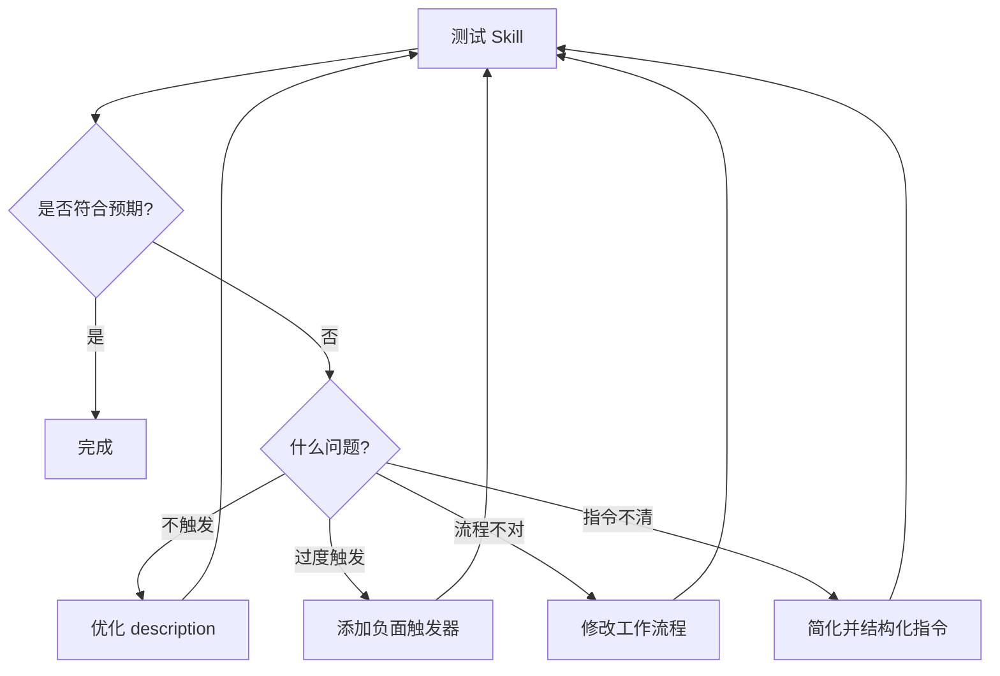

# Skill Creator 完整教程：创建需求澄清技能

> 📚 **面向对象**：SKILL 初学者  
> ⏱️ **预计时间**：15-30 分钟  
> 🎯 **学习目标**：掌握使用 skill-creator 创建专业 SKILL 的完整流程

---

## 目录

1. [前置知识](#前置知识)
2. [Skill 基础概念](#skill-基础概念)
3. [规划阶段：明确用例](#规划阶段明确用例)
4. [使用 skill-creator 创建 SKILL](#使用-skill-creator-创建-skill)
5. [完善 SKILL 内容](#完善-skill-内容)
6. [测试与迭代](#测试与迭代)
7. [部署与使用](#部署与使用)
8. [常见问题排查](#常见问题排查)

---

## 前置知识

### 什么是 Skill？

Skill（技能）是一个包含指令的文件夹，用于教会 Claude 如何处理特定任务或工作流程。它就像是给 Claude 配备的"专业能力包"。

### Skill 的文件结构

```
skill-name/
├── SKILL.md           # 必需：包含 YAML 前置信息和 Markdown 指令
├── scripts/           # 可选：可执行代码（Python、Bash 等）
├── references/        # 可选：按需加载的文档
└── assets/            # 可选：模板、字体、图标等
```

### 三层渐进式加载机制

| 层级 | 内容 | 何时加载 | 目的 |
|------|------|----------|------|
| **第一层** | YAML frontmatter | 系统启动时（始终） | 让 Claude 知道何时使用该 Skill |
| **第二层** | SKILL.md 正文 | Claude 认为相关时 | 提供完整的指令和指导 |
| **第三层** | 链接文件 | Claude 需要时 | 提供额外的详细信息 |

---

## Skill 基础概念

### 设计原则

1. **渐进式披露（Progressive Disclosure）**：分层加载信息，最小化 token 使用
2. **可组合性（Composability）**：可与其他 Skill 同时使用
3. **可移植性（Portability）**：在 Claude.ai、Claude Code、API 间无缝工作

### Skill 的三种常见类型

| 类型 | 用途 | 示例 |
|------|------|------|
| **文档与资产创建** | 创建一致、高质量的输出 | frontend-design, docx |
| **工作流自动化** | 多步骤流程的标准化 | skill-creator |
| **MCP 增强** | 为 MCP 服务器提供工作流指导 | sentry-code-review |

---

## 规划阶段：明确用例

> ⚠️ **重要**：在编写任何代码前，先明确 2-3 个具体用例

### 案例：需求澄清 Skill

#### 1️⃣ 用例定义

**用例名称**：需求澄清与问题提问

**触发条件**：
- 用户请求有多种合理解释
- 关键细节不清楚（目标、范围、限制、环境、安全性）

**工作流程**：
```
Step 1: 判断需求是否不明确
  ├─ 检查：目标是否清晰？
  ├─ 检查：完成标准是否明确？
  ├─ 检查：范围是否定义？
  ├─ 检查：约束是否清楚？
  ├─ 检查：环境是否识别？
  └─ 检查：安全性/可逆性是否澄清？
  
Step 2: 提出 1-5 个必须回答的问题
  ├─ 优化可扫描性（编号、简短）
  ├─ 提供多项选择
  ├─ 建议合理默认值
  └─ 包含快速响应路径（如 "defaults"）
  
Step 3: 暂停等待回答
  ├─ 不运行命令
  ├─ 不编辑文件
  └─ 不制定详细计划
  
Step 4: 确认理解后继续
  └─ 用 1-3 句话重述需求
```

**预期结果**：
- 用户明确需求后才开始实施
- 避免方向性错误
- 减少返工成本

#### 2️⃣ 成功标准

| 指标类型 | 标准 | 如何衡量 |
|----------|------|----------|
| **触发准确率** | 90% 的相关查询能触发 | 运行 10-20 个测试查询 |
| **工作流效率** | 1-5 个问题即可澄清 | 对比有无 Skill 的对话轮数 |
| **用户体验** | 用户无需主动引导 | Beta 测试用户反馈 |

#### 3️⃣ 自检清单

在进入开发前，确认：

- [ ] 是否有明确的、可重复的工作流程？
- [ ] 是否可以用自然语言清晰描述流程？
- [ ] 是否有 2-3 个具体的使用场景？
- [ ] 是否能够定义"成功"的标准？
- [ ] 是否适合用 Skill（而非简单提示词）来实现？

---

## 使用 skill-creator 创建 SKILL

### 方法 1：在 Claude.ai 或 Claude Code 中使用（推荐）

#### Step 1：启动 skill-creator

在对话中输入：

```
帮我使用 skill-creator 创建一个新的 Skill
```

或者更具体地：

```
我想创建一个 Skill，用于在实施任务前澄清模糊的需求。请使用 skill-creator 引导我。
```

#### Step 2：回答 skill-creator 的引导问题

skill-creator 会逐步询问以下信息：

**问题 1：Skill 的名称**
```
请提供 Skill 的名称（使用 kebab-case 格式）：
```

**回答示例**：
```
clarify-demand-uncertainty
```

**问题 2：Skill 的描述**
```
请描述这个 Skill 的功能和使用场景（包含触发短语）：
```

**回答示例**：
```
在实施之前澄清需求。当出现严重疑问时使用。适用于请求有多种合理解释或关键细节不清楚的场景。
```

**问题 3：核心用例**
```
请描述 2-3 个具体的使用场景：
```

**回答示例**：
```
用例 1: 前端功能开发
用户说："在设置页面加一个夜间模式开关"
Skill 应该提问：开关位置、持久化方式、生效范围、系统跟随等

用例 2: 后端 API 开发
用户说："写一个用户注册接口"
Skill 应该提问：必填字段、验证方式、密码规则、注册后行为等

用例 3: 代码重构
用户说："优化这个函数的性能"
Skill 应该提问：性能目标、约束条件、是否可以改变接口等
```

**问题 4：工作流程步骤**
```
请描述 Skill 的核心工作流程：
```

**回答示例**：
```
1. 判断请求是否不明确（检查目标、范围、约束等）
2. 提出 1-5 个关键澄清问题（优化可扫描性、提供多选项、建议默认值）
3. 暂停等待用户回答（不执行任何实施操作）
4. 确认理解后重述需求并继续
```

**问题 5：额外配置**
```
是否需要依赖特定工具或 MCP 服务器？
```

**回答示例**：
```
不需要，仅依赖 Claude 的内置能力
```

#### Step 3：生成初始 SKILL.md

skill-creator 会生成初始版本：

```markdown
---
name: clarify-demand-uncertainty
description: 在实施之前澄清需求。当出现严重疑问时使用。
---

# 如果需求不明确则提问

## 何时使用
[skill-creator 会根据你的输入生成此部分]

## 工作流程
[skill-creator 会根据你的输入生成此部分]

...
```

#### Step 4：审查与迭代

skill-creator 会询问：

```
请审查生成的 SKILL.md，是否需要调整？
```

你可以提出修改建议，例如：

```
请在"工作流程"部分添加具体的问题模板示例
```

或

```
请在"何时不使用"部分补充说明
```

---

### 方法 2：手动创建（备选方案）

如果你无法访问 skill-creator，可以手动创建：

#### Step 1：创建文件夹和文件

```bash
mkdir -p clarify-demand-uncertainty
touch clarify-demand-uncertainty/SKILL.md
```

#### Step 2：编写 YAML frontmatter

在 `SKILL.md` 顶部添加：

```yaml
---
name: clarify-demand-uncertainty
description: 在实施之前澄清需求。当出现严重疑问时使用。
---
```

#### Step 3：编写 Markdown 正文

参考 [完善 SKILL 内容](#完善-skill-内容) 章节。

---

## 完善 SKILL 内容

### SKILL.md 的标准结构

```markdown
---
name: skill-name
description: 简洁的描述，包含触发条件
---

# 主标题

## 何时使用
[明确触发条件]

## 何时**不**使用
[避免滥用]

## 目标
[核心目的]

## 工作流程
[详细步骤]

### 步骤 1: [名称]
[具体说明]

### 步骤 2: [名称]
[具体说明]

...

## 示例/模板
[可操作的示例]

## 反模式
[常见错误]
```

### 关键要素详解

#### 1. **YAML frontmatter**（必需）

```yaml
---
name: clarify-demand-uncertainty          # kebab-case，无空格、无大写
description: 在实施之前澄清需求。当出现严重疑问时使用。  # 包含触发短语
---
```

**描述字段的最佳实践**：

✅ **好的描述**：
```yaml
description: 在实施之前澄清需求。当出现严重疑问时使用。适用于请求有多种合理解释或关键细节不清楚的场景。
```

❌ **差的描述**：
```yaml
description: 帮助处理项目  # 太泛化
```

#### 2. **何时使用 / 何时不使用**

**目的**：帮助 Claude 准确判断是否应该触发该 Skill

**示例**：

```markdown
## 何时使用

当请求有多种合理的解释或关键细节（目标、范围、限制、环境或安全性）不清楚时，请使用此技能。

## 何时**不**使用

当请求已经很明确，或者可以通过快速、低风险的探索性阅读来回答缺失的细节时，请勿使用此技能。
```

#### 3. **工作流程**

**原则**：
- 使用编号列表
- 每步清晰可执行
- 包含决策点（if/else）
- 包含验证门（validation gates）

**示例**：

```markdown
## 工作流程

### 1) 决定请求是否不明确

如果在探索如何执行工作后，以下部分或全部内容不清楚，则将请求视为不明确：
- 定义目标（什么应该改变 vs 保持不变）
- 定义"完成"（验收标准、示例、边缘情况）
- 定义范围（哪些文件/组件/用户在范围内/外）
- 定义约束（兼容性、性能、风格、依赖项、时间）
- 识别环境（语言/运行时版本、操作系统、构建/测试运行器）
- 澄清安全性/可逆性（数据迁移、推出/回滚、风险）

如果存在多种合理的解释，则假设它是不明确的。

### 2) 先问必须问的问题（保持简短）

在第一轮中提出 1-5 个问题。倾向于提出能够排除整个工作分支的问题。

让问题易于回答：
- 优化可扫描性（简短的编号问题；避免段落）
- 尽可能提供多项选择选项
- 在适当的时候建议合理的默认值
- 包含快速路径响应（例如，回复 `defaults` 以接受所有推荐选择）

### 3) 在行动前暂停

在收到必须回答的答案之前：
- 不要运行命令、编辑文件或制定依赖于未知因素的详细计划
- 仅执行明确标记的、低风险的探索步骤

### 4) 确认解释，然后继续

一旦你有了答案，用 1-3 句话重述需求，然后开始工作。
```

#### 4. **示例与模板**

**目的**：提供可直接复用的范例

**示例**：

```markdown
## 问题模板

使用编号问题和字母选项以及清晰的回复格式：

```text
1) 范围?
a) 最小更改 (默认)
b) 重构并触及该区域
c) 不确定 - 使用默认值

2) 兼容性目标?
a) 当前项目默认值 (默认)
b) 也支持旧版本: <指定>
c) 不确定 - 使用默认值

回复: defaults (或 1a 2a)
```
```

#### 5. **反模式**

**目的**：避免常见错误

**示例**：

```markdown
## 反模式

- 不要问你可以通过快速、低风险的探索性阅读来回答的问题
- 如果紧凑的多项选择能更快消除歧义，不要问开放式问题
- 不要在没有明确不确定性的情况下触发此 Skill
```

---

### 可选字段

#### metadata（可选）

```yaml
---
name: clarify-demand-uncertainty
description: 在实施之前澄清需求。当出现严重疑问时使用。
metadata:
  author: Your Name
  version: 1.0.0
  category: workflow
  tags: [clarification, requirements, planning]
---
```

#### allowed-tools（可选）

限制 Skill 可使用的工具：

```yaml
---
name: data-analysis
description: 数据分析技能
allowed-tools: "Bash(python:*) WebFetch"
---
```

---

## 测试与迭代

### 测试清单

#### 1️⃣ **触发测试**（Trigger Test）

**目标**：验证 Skill 在正确场景下触发

**测试用例**：

| 测试场景 | 预期结果 | 实际结果 |
|----------|----------|----------|
| 模糊的前端需求："加个按钮" | ✅ 触发 | _(待测试)_ |
| 模糊的后端需求："写个接口" | ✅ 触发 | _(待测试)_ |
| 清晰的需求："使用 React 在 Header.tsx 第 25 行添加一个红色按钮" | ❌ 不触发 | _(待测试)_ |
| 简单的探索性任务："列出项目中的所有文件" | ❌ 不触发 | _(待测试)_ |

**测试方法**：

在 Claude 中输入测试用例，观察是否加载 Skill：

```
测试 1: 在设置页面加一个夜间模式开关
```

如果 Claude 直接开始编码而没有提问，说明 Skill 未触发，需要优化 `description` 字段。

#### 2️⃣ **工作流测试**（Workflow Test）

**目标**：验证 Skill 是否按预期工作流程执行

**测试用例**：

```
用户输入: "写一个用户注册接口"

预期行为:
Step 1: Skill 触发
Step 2: 提出 1-5 个澄清问题（字段、验证、密码、注册后行为）
Step 3: 等待用户回答（不执行代码）
Step 4: 收到回答后重述需求并开始实施
```

**测试方法**：

完整运行一次工作流，检查：

- [ ] 是否提问？
- [ ] 问题是否简洁（1-5 个）？
- [ ] 是否提供多项选择？
- [ ] 是否有默认值建议？
- [ ] 是否在收到回答前暂停？
- [ ] 是否重述需求后再执行？

#### 3️⃣ **边界测试**（Boundary Test）

**目标**：验证 Skill 在边缘情况下的表现

**测试用例**：

| 场景 | 预期行为 |
|------|----------|
| 用户提供部分信息 | 仅询问缺失的关键信息 |
| 用户说"使用默认值" | 立即使用合理默认值继续 |
| 用户回答不清楚 | 进一步澄清，不做假设 |
| 用户明确说"先不要问，直接做" | 列出假设，要求确认后再执行 |

#### 4️⃣ **集成测试**（Integration Test）

**目标**：验证与其他 Skill 的兼容性

**测试方法**：

1. 同时启用多个 Skill
2. 给出复杂任务："分析营销数据并根据结果创建报告"
3. 观察是否正确触发多个 Skill
4. 验证 Skill 之间不冲突

---

### 迭代优化流程



#### 常见问题与解决方案

| 问题 | 原因 | 解决方案 |
|------|------|----------|
| Skill 从不触发 | description 太泛化 | 添加具体的触发短语和文件类型 |
| Skill 触发过于频繁 | description 太宽泛 | 添加"何时不使用"和负面触发器 |
| Claude 不遵循指令 | 指令太冗长或模糊 | 使用项目符号、编号列表、明确语言 |
| 工作流程跳步 | 缺少验证门 | 添加"在...之前，不要..."的明确指令 |

---

## 部署与使用

### 部署方式

#### 方式 1：项目级 Skill（推荐用于团队协作）

将 Skill 放在项目目录中，随代码库分发：

```bash
# 在项目根目录
mkdir -p .claude/skills
cp -r clarify-demand-uncertainty .claude/skills/

# 提交到版本控制
git add .claude/skills/clarify-demand-uncertainty
git commit -m "添加需求澄清技能"
```

**优点**：
- 团队成员自动获得
- 确保一致性
- 可版本控制

#### 方式 2：个人全局 Skill（适用于个人使用）

将 Skill 放在全局目录，应用于所有项目：

```bash
# 在用户主目录
mkdir -p ~/.claude/skills
cp -r clarify-demand-uncertainty ~/.claude/skills/
```

**优点**：
- 一次安装，所有项目可用
- 个人化定制

#### 方式 3：打包分发（适用于开源或团队间共享）

```bash
# 压缩为 .zip 文件
cd clarify-demand-uncertainty
zip -r ../clarify-demand-uncertainty.zip .

# 分享给他人
# 其他人可以解压到 .claude/skills/ 目录
```

---

### 在 Claude.ai 中使用

1. **上传 Skill**：
   - 点击左下角的 "Skills" 图标
   - 点击 "Upload Skill"
   - 选择 `clarify-demand-uncertainty` 文件夹（或 .zip 文件）

2. **启用 Skill**：
   - 在 Skills 面板中找到 `clarify-demand-uncertainty`
   - 切换开关启用

3. **测试**：
   - 开启新对话
   - 输入模糊需求："在首页添加一个搜索框"
   - 观察 Skill 是否触发并提问

---

### 在 Claude Code 中使用

Claude Code 会自动扫描：

- `~/.claude/skills/`（个人全局）
- `.claude/skills/`（项目级）

**步骤**：

1. **放置 Skill**：
   ```bash
   cp -r clarify-demand-uncertainty ~/.claude/skills/
   ```

2. **重启 Claude Code**（如需要）

3. **测试**：
   - 在代码编辑器中选中一段代码
   - 输入："优化这个函数"
   - Skill 应自动触发并提问

---

### 通过 API 使用

如果你通过 API 调用 Claude，Skill 需要通过系统提示词加载：

```python
import anthropic

client = anthropic.Anthropic(api_key="your-api-key")

# 读取 SKILL.md 内容
with open("clarify-demand-uncertainty/SKILL.md", "r") as f:
    skill_content = f.read()

response = client.messages.create(
    model="claude-sonnet-4-20250514",
    max_tokens=4096,
    system=f"{skill_content}\n\n请遵循上述技能的指导。",
    messages=[
        {"role": "user", "content": "在设置页面加一个夜间模式开关"}
    ]
)

print(response.content)
```

---

## 常见问题排查

### 问题 1: Skill 无法上传

**错误信息**：`"Could not find SKILL.md in uploaded folder"`

**原因**：文件名不正确

**解决方案**：

```bash
# 检查文件名（区分大小写）
ls -la clarify-demand-uncertainty/

# 应该看到 SKILL.md（不是 skill.md 或 Skill.md）
```

---

### 问题 2: 无效的 frontmatter

**错误信息**：`"Invalid frontmatter"`

**原因**：YAML 格式错误

**检查清单**：

❌ **错误示例**：

```yaml
# 缺少分隔符
name: my-skill
description: Does things
```

```yaml
# 未闭合的引号
name: my-skill
description: "Does things
```

✅ **正确示例**：

```yaml
---
name: my-skill
description: Does things
---
```

**验证工具**：使用在线 YAML 验证器检查语法

---

### 问题 3: Skill 从不触发

**症状**：Skill 在相关查询时不加载

**诊断步骤**：

1. **询问 Claude**：
   ```
   "你何时会使用 clarify-demand-uncertainty Skill？"
   ```

2. **Claude 会引用 description**，检查是否合理

3. **修改 description**：

   ❌ **太泛化**：
   ```yaml
   description: 帮助处理项目
   ```

   ✅ **具体化**：
   ```yaml
   description: 在实施之前澄清需求。当出现严重疑问时使用。适用于请求有多种合理解释或关键细节（目标、范围、约束）不清楚的场景。
   ```

4. **重新上传并测试**

---

### 问题 4: Skill 触发过于频繁

**症状**：Skill 在不相关的查询时加载

**解决方案**：

#### 方案 1：添加负面触发器

```markdown
## 何时使用

当请求有多种合理的解释时使用。

## 何时**不**使用

- 请求已经明确时
- 可以通过快速探索性阅读回答时
- 简单的信息检索任务
```

#### 方案 2：更精确的 description

```yaml
# 太宽泛
description: 处理文档

# 更精确
description: 处理 PDF 法律文档的合同审查
```

---

### 问题 5: Claude 不遵循指令

**症状**：Skill 加载但 Claude 不按流程执行

**原因与解决方案**：

| 原因 | 解决方案 |
|------|----------|
| 指令太冗长 | 使用项目符号、编号列表 |
| 指令埋没在文本中 | 将关键指令置于顶部，使用 `## 重要` 标题 |
| 语言模糊 | 使用明确的语言："在调用 X 之前，必须验证 Y" |

**示例改进**：

❌ **模糊**：
```markdown
确保正确验证所有内容
```

✅ **明确**：
```markdown
## 关键

在调用 `create_project` 之前，必须验证：
- 项目名称非空
- 至少分配一名团队成员
- 开始日期不在过去
```

---

### 问题 6: MCP 连接失败

**症状**：Skill 加载但 MCP 调用失败

**检查清单**：

1. **验证 MCP 服务器已连接**：
   - Claude.ai: Settings > Extensions > [服务名]
   - 应显示 "Connected" 状态

2. **检查认证**：
   - API 密钥有效且未过期
   - 权限/作用域正确
   - OAuth token 已刷新

3. **独立测试 MCP**：
   ```
   使用 [服务] MCP 获取我的项目列表
   ```
   如果失败，问题在 MCP 而非 Skill

4. **验证工具名称**：
   - Skill 引用的 MCP 工具名称正确
   - 工具名称区分大小写

---

## 最佳实践总结

### ✅ Do（应该做）

- **先规划后编码**：明确 2-3 个用例再动手
- **保持简洁**：SKILL.md 控制在 5,000 词以内
- **使用结构化格式**：编号列表、项目符号、表格
- **提供示例**：可操作的模板和范例
- **明确边界**：清晰说明"何时使用"和"何时不使用"
- **迭代优化**：根据测试结果持续改进
- **添加注释**：解释复杂的逻辑
- **版本控制**：使用 Git 跟踪 Skill 变更

### ❌ Don't（不应该做）

- **不要使用 XML 标签**：`<tag>` 在 YAML 中被禁止
- **不要使用模糊描述**："帮助处理事物"
- **不要假设上下文**：Skill 应独立工作
- **不要过度触发**：避免在不相关场景加载
- **不要冗长啰嗦**：精简指令，移除冗余
- **不要跳过测试**：上传前必须测试
- **不要硬编码**：使用变量和占位符

---

## 进阶技巧

### 1. 使用 references/ 目录

对于大型文档或参考资料，使用 references/ 目录：

```
clarify-demand-uncertainty/
├── SKILL.md
└── references/
    ├── question-templates.md
    └── best-practices.md
```

在 SKILL.md 中链接：

```markdown
详细的问题模板请参考 [question-templates.md](references/question-templates.md)
```

### 2. 使用 scripts/ 目录

对于需要代码验证的场景，添加脚本：

```
clarify-demand-uncertainty/
├── SKILL.md
└── scripts/
    └── validate_requirements.py
```

在 SKILL.md 中引用：

```markdown
使用 `scripts/validate_requirements.py` 验证需求完整性
```

### 3. 组合多个 Skill

设计 Skill 时考虑组合性：

```markdown
## 与其他 Skill 的配合

- 与 `frontend-design` 配合：先澄清需求，再创建设计
- 与 `tdd-workflow` 配合：先澄清需求，再编写测试
```

### 4. 版本管理

在 metadata 中记录版本：

```yaml
---
name: clarify-demand-uncertainty
description: 在实施之前澄清需求。当出现严重疑问时使用。
metadata:
  version: 1.2.0
  changelog:
    - 1.2.0: 添加快速响应路径支持
    - 1.1.0: 优化问题模板
    - 1.0.0: 初始版本
---
```

---

## 资源与参考

### 官方文档

- [Anthropic Skills 官方文档](https://code.claude.com/docs/en/skills)
- [The Complete Guide to Building Skills for Claude](https://github.com/anthropics/skills)
- [Best Practices Guide](https://docs.anthropic.com/claude/docs/skills-best-practices)

### 示例 Skill

- [Anthropic Skills 仓库](https://github.com/anthropics/skills)
- [skill-creator Skill](https://github.com/anthropics/skills/blob/main/skills/skill-creator/SKILL.md)
- [frontend-design Skill](https://github.com/anthropics/skills/blob/main/skills/frontend-design/SKILL.md)

### 社区支持

- [Claude Developers Discord](https://discord.gg/claude-developers)
- [GitHub Issues](https://github.com/anthropics/skills/issues)

---

## 完整示例：clarify-demand-uncertainty

完整的 SKILL.md 文件请参考：
- [FlySkill/skills/clarify-demand-uncertainty/SKILL.md](../skills/clarify-demand-uncertainty/SKILL.md)

---

## 快速检查清单

使用此清单在上传前验证你的 Skill：

### 开发前

- [ ] 已识别 2-3 个具体用例
- [ ] 已确定所需工具（内置或 MCP）
- [ ] 已审查本指南和示例 Skill
- [ ] 已规划文件夹结构

### 开发中

- [ ] 文件夹名称为 kebab-case
- [ ] SKILL.md 文件存在（大小写正确）
- [ ] YAML frontmatter 有 `---` 分隔符
- [ ] `name` 字段：kebab-case，无空格、无大写
- [ ] `description` 包含"做什么"和"何时用"
- [ ] 没有 XML 标签（`<` `>`）
- [ ] 指令清晰可执行
- [ ] 包含错误处理
- [ ] 提供示例
- [ ] 清晰链接 references

### 上传前

- [ ] 测试：明显任务能触发
- [ ] 测试：改写请求能触发
- [ ] 测试：不相关主题不触发
- [ ] 功能测试通过
- [ ] 工具集成工作（如适用）
- [ ] 已压缩为 .zip 文件（如需要）

### 上传后

- [ ] 在真实对话中测试
- [ ] 监控触发频率
- [ ] 收集用户反馈
- [ ] 迭代优化 description 和指令
- [ ] 更新 metadata 中的版本

---

## 总结

通过本教程，你应该已经掌握了：

1. ✅ Skill 的基础概念和设计原则
2. ✅ 如何使用 skill-creator 创建 Skill
3. ✅ 如何完善 SKILL.md 的各个部分
4. ✅ 如何测试和迭代 Skill
5. ✅ 如何部署和使用 Skill
6. ✅ 常见问题的排查方法

**下一步行动**：

1. 选择一个你经常重复的工作流程
2. 使用 skill-creator 创建你的第一个 Skill
3. 测试并迭代
4. 分享给团队或社区

**预计时间**：按照本教程，你应该能在 15-30 分钟内创建你的第一个可用 Skill！

---

📚 **更多资源**：
- [FlySkill 项目](https://github.com/Agent101/FlySkill)
- [示例：营销活动分析](../examples/analyzing-marketing-campaign/)
- [示例：需求澄清](../examples/clarify-demand-uncertainty/)

💬 **反馈与支持**：
如有问题，请在 GitHub Issues 中提出，或加入 Claude Developers Discord 社区。

---

*本教程由 FlySkill 项目维护，基于 Anthropic 官方指南编写。*  
*最后更新：2026-02-02*

